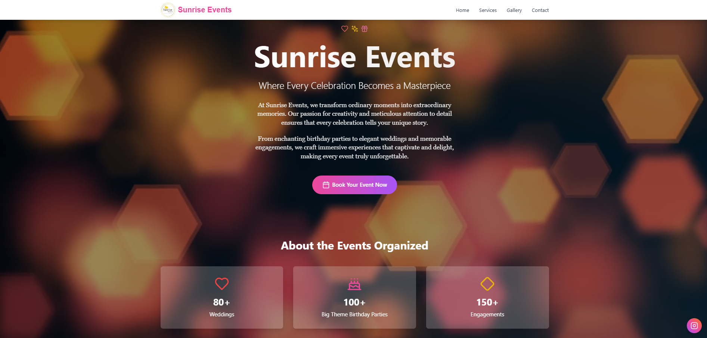
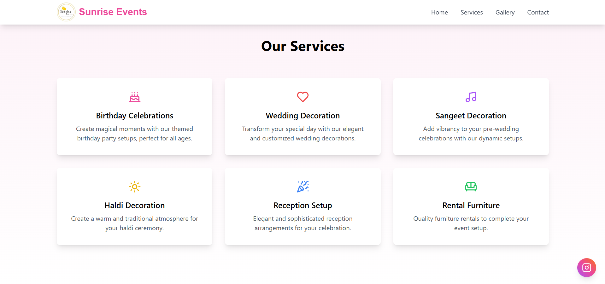
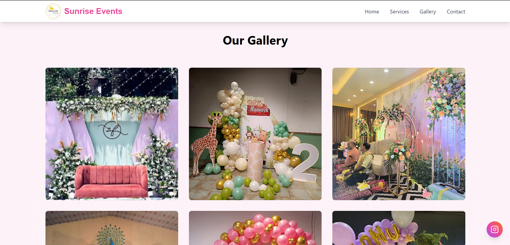
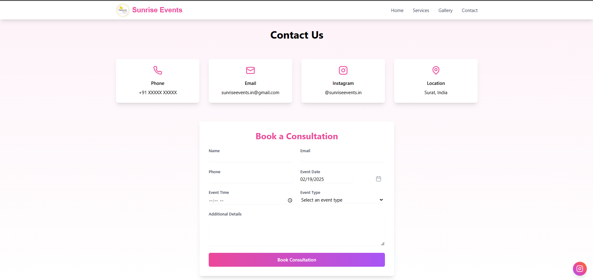
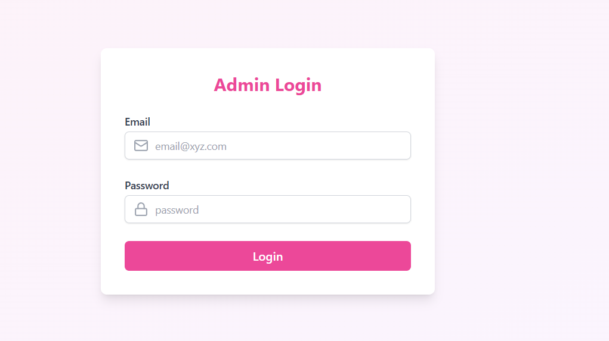
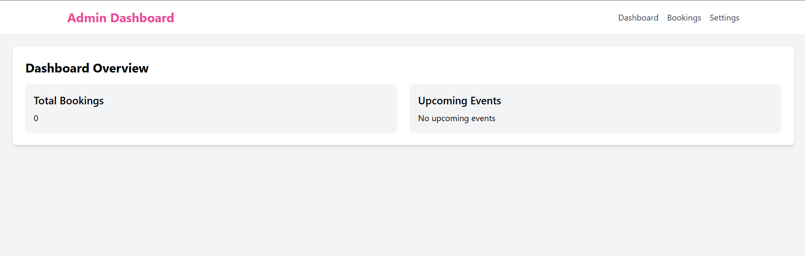

# Sunrise Events
<h5>Team - Bugging Bad</h5>

Welcome to Sunrise Events, where every celebration becomes a masterpiece. This project is a fully-featured event management website built with React, TypeScript, Tailwind CSS, and Node.js. It includes functionalities for booking consultations, managing services, galleries, and settings, and provides an admin dashboard for managing the website content.

## Table of Contents

- [Features](#features)
- [Technologies Used](#technologies-used)
- [Installation](#installation)
- [Usage](#usage)
- [Screenshots](#screenshots)
- [Project Structure](#project-structure)
- [Installation](#installation)
- [Database Setup](#database-setup)
- [API Endpoints](#api-endpoints)
- [Future Enhancements](#future-enhancements)
- [Contributers](#contributors)

## Features

### User Features

- **Home Page**: A beautiful landing page with a video background and an overview of the services offered.
- **Services Page**: Detailed information about the various services provided by Sunrise Events.
- **Gallery Page**: A gallery showcasing images from past events.
- **Contact Page**: A contact form for booking consultations with a date picker and other input fields.
- **Floating Instagram Button**: A floating button that links to the Instagram page of Sunrise Events.

### Admin Features

- **Admin Login**: Secure login for administrators.
- **Dashboard Overview**: Overview of total bookings and upcoming events.
- **Booking Management**: Manage consultation bookings with options to approve, reject, or reschedule.
- **Service Management**: Add, edit, and delete services offered by Sunrise Events.
- **Gallery Management**: Upload and delete images in the gallery.
- **Settings Management**: Update contact information and other settings.

## Technologies Used

- **Frontend**:

  - React
  - TypeScript
  - Tailwind CSS
  - Lucide React for icons
  - React Router for navigation
  - React DatePicker for date selection

- **Backend**:
  - Node.js
  - Express
  - PostgreSQL
  - dotenv for environment variables

## Screenshots

- HomePage
  
- Services Page
  
- Gallery Page
  
- Contact Page
  
- AdminLogin Page
  
- AdminDashboard Page
  

## Usage

- Access the Website:

  - Open your web browser and go to [http://localhost:5173](http://localhost:5173) to access the website.

- Admin Login:

  - Navigate to [http://localhost:5173/admin](http://localhost:5173/admin) to access the admin login page. Use the following credentials:

  - Email: `admin@sunriseevents.com`
  - Password: `ADMIN`

- Admin Dashboard:

- After logging in, you can manage :

  - Bookings
  - Services
  - Gallery
  - Settings

## Project Structure

```
.bolt/
  config.json
  prompt
.gitignore
backend/
  .env
  nodemon.json
  package.json
  src/
    index.ts
  tsconfig.json
eslint.config.js
homepage.jpg
images/
  images (1).jpg
  ...
index.html
logo.png
package.json
postcss.config.js
src/
  components/
    AdminNavbar.tsx
    BookingCalendar.tsx
    BookingManagement.tsx
    DashboardOverview.tsx
    EventStats.tsx
    FloatingInstagram.tsx
    Gallery.tsx
    GalleryManagement.tsx
    Loading.tsx
    Navbar.tsx
    ServiceCard.tsx
    ServiceManagement.tsx
    Settings.tsx
    Sidebar.tsx
  pages/
    AdminDashboard.tsx
    AdminLogin.tsx
    Contact.tsx
    Gallery.tsx
    Home.tsx
    Services.tsx
  App.tsx
  main.tsx
  vite-env.d.ts
Sunrise.png
tailwind.config.js
tsconfig.app.json
tsconfig.json
tsconfig.node.json
txtLogo.jpg
videos/
vite.config.ts
```

## Installation

1. Clone the repository:
   ```bash
   git clone https://github.com/GWOC-25/Sunrise_Events.git
   cd GWOC-25/Sunrise_Events
   ```
2. Install dependencies:
   ```bash
   npm install
   cd backend
   npm install
   cd ..
   ```
3. Set up environment variables:
   Create a .env file in the backend directory with the following content:
   ```
   DATABASE_URL=your-database-url
   ```
4. Start Backend Server:
   ```bash
   cd backend
   npm start
   ```
5. Start Frontend:
   (in project directory)
   ```bash
   npm run dev
   ```

## Database Setup

### PostgreSQL Schema

Run the following SQL commands to create the required `settings` and `consultations` tables:

```sql
CREATE TABLE settings (
    id SERIAL PRIMARY KEY,
    phone VARCHAR(20),
    email VARCHAR(100),
    instagram VARCHAR(100),
    location TEXT
);

CREATE TABLE consultations (
    id SERIAL PRIMARY KEY,
    name VARCHAR(100),
    email VARCHAR(100),
    date DATE,
    time TIME,
    notes TEXT
);
```

## API Endpoints

### Public Endpoints

- `GET /` - Root endpoint
- `GET /db-test` - Test database connection
- `GET /consultations` - Retrieve all consultations
- `POST /consultations` - Create a new consultation
- `GET /dashboard-data` - Get dashboard statistics

### Settings Endpoints

- `GET /settings` - Retrieve settings
- `PUT /settings` - Update settings

## Future Enhancements

- Implement authentication for admin panel.
- Add user login and role-based access control.
- Improve UI/UX with animations and transitions.
- Implement email notifications for bookings.

## Contributors

- **<a href="https://www.linkedin.com/in/kanhaiya-chhaparwal/">Kanhaiya Chhaparwal</a>** - Developer
- **<a href="https://www.linkedin.com/in/AnujSule/">Anuj Sule</a>** - Developer
- **<a href="https://www.linkedin.com/in/hritesh-bansal-42bb48314/">Hritesh Bansal</a>** - Developer
- **<a href="https://www.linkedin.com/in/yuvraj-srivastava-202343308/">Yuvraj Srivastava</a>** - Developer

  <br>
  <br>

### 🔥 Built with Express.js, PostgreSQL, React, and Tailwind CSS

---
